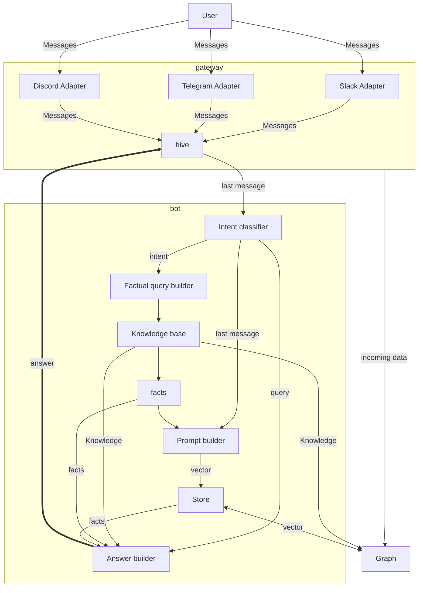

!! Ignore this


### Future API

<details>
  <summary>Future API</summary>

The only mandatory component in this architecture is an **"Answer Builder Bot"**. This bot is responsible for constructing responses to user queries.

The architecture is designed to be flexible and extensible, allowing for the addition of new components or the replacement of existing ones. This makes it possible to customize the system to meet specific needs or to experiment with different configurations.




### Intent Classifier

The system also includes an intent classifier, which is responsible for determining which prompt to use to call other documents. This classifier can be a simple identity function that passes the query directly to the prompt builder, or it can be a more complex function that makes decisions based on the content of the query.

### Prompt builder

The prompt builder is another key component of the system. It can be a simple GPT-3 model with a single prompt, or it can be a more complex function that constructs prompts based on the content of the query and other factors.

## External interfaces

The system may also include interfaces to a knowledge base and to any external system that the user wants to integrate with. These interfaces allow the system to access and use information from these external sources when constructing responses to user queries.

The architecture is designed to be public, with the exception of the back-end APIs. This means that competitors can create their own versions of the components and integrate them into the system.

The system is designed to be compatible with the marketplace format, making it possible for users to create and sell their own components.

### Connecting to external systems

The system is designed to allow the use of standard APIs, such as OpenAI and Metaphor, within the templates. These APIs can be called from within the Microsoft Guidance templates that define the components of the system.

The system also allows for the integration of external data stores. These data stores are the responsibility of whoever wants to create them. The addresses of these data stores can be declared at the top of the Guidance files. This allows the system to access and use data from these stores when constructing responses to user queries.

However, it's important to note that someone who doesn't know any prompting can't provide a better "observability instrument". This means that the ability to create and integrate effective components into the system requires some knowledge and understanding of how prompting works.

In summary, the system is designed to be flexible and extensible, allowing for the integration of a variety of external APIs and data stores. This makes it possible for users to customize the system to meet their specific needs and to experiment with different configurations.

### Example bot

API spec (yahoo finance):

```yaml
name: YahooFinanceAPI
description: API for getting quotes from Yahoo Finance
baseURL: https://finance.yahoo.com/quote/
endpoints:
  - name: getQuote
    path: /{symbol}
    method: GET
    parameters:
      - name: symbol
        in: path
        required: true
        description: The symbol of the stock to get a quote for
        schema:
          type: string
```

### Answer builder (note the first `#assistant`)

```handlebars
{{#system~}}
You are an intelligent assistant.
{{~/system}}

{{#user~}}
What is the current price of {{symbol}}?
{{~/user}}

{{#assistant to=YahooFinanceAPI.getQuote~}}
{
  "symbol": "{{symbol}}"
}
{{~/assistant}}

{{#assistant~}}
The current price of {{symbol}} is {{price}}.
{{~/assistant}}
```

</details>
