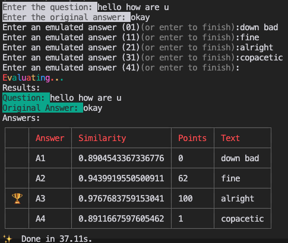

# hive/annex

## Process Description

1. There is a main utility bot that is used to register other bots.
2. Each bot is represented by an endpoint and a username.
3. When a bot is tagged or replied to, the system will call the bot's endpoint with the following parameters:
   - **context**: Previous messages relevant to the request.
   - **conversation**: If previous exchanges with the bot occurred, a set of these exchanges.
   - **message**: The tagged/reply message.
   - **users**: Information on mentioned users, by id.
4. The bot will respond with a message.
5. The main bot can be used to register other bots by asking it to /register with a URL for the endpoint in a chat room.

## Bots API

Each bot will be defined by:

- a username
- the name of the person it is emulating
- an endpoint (URL)

### Request [POST]

- Headers
  - X-CALLER-KEY: A secret key that we will use to authenticate the request.
- Body
  - **context** (array[Message], required) - Previous messages relevant to the request.
  - **conversation** (array[Conversation], optional) - If previous exchanges with the bot occurred, a set of these exchanges.
  - **message** (Message, required) - The tagged/reply message.
  - **users** (array[User], optional) - Information on mentioned users, by id.
  
<details>
  <summary>Type definitions</summary>

### Message (object)

- **from** (string, required) - The id of the user who sent the message, or "BOT" if the message was sent by the bot.
- **tagged** (array[string], optional) - The ids of the users who were tagged in the message.
- **id** (string, required) - The unique identifier for the message.
- **text** (string, required) - The content of the message.
- **timestamp** (string, required) - The time when the message was sent.

### Conversation (object)
- **id** (string, required) - The unique identifier for the conversation.
- **messages** (array[Message], required) - The messages in the conversation, ie all the tagged/reply messages from the channel, plus the bot's reply.

### User (object)
- **id** (string, required) - The unique identifier for the user.
- **username** (string, required) - The username of the user.

</details>

### Response

- **message** (string, required) - The message to be sent to the channel.

The response message will automatically tag users in the message if they were tagged in the original message, unless the message is already a reply to a message that was tagged.

The bot's message will be posted as a reply.

## Evaluating bots

The bot emulating each person will be evaluated based on its ability to generate relevant and coherent responses. The evaluation process will involve the following steps.

1. The bot receives a conversation parameter, which is an array of Message objects. Each Message object represents a previous message in the conversation.
2. The bot's response is recorded, and it is compared via embeddings distance to the original one. The closer the response, the higher the score.
3. The bot's answer and performance is recorded.

The process is repeated with more sections of the conversation: first with the first question only, then with the original first question, the original first answer and the secong question, and so on.

The conversation parameter is an array of Message objects. Each Message object has the following structure:

```json
[{
  "from": "string", // The id of the user who sent the message.
  "tagged": ["string"], // The ids of the users who were tagged in the message.
  "id": "string", // The unique identifier for the message.
  "text": "string", // The content of the message.
  "timestamp": "string" // The time when the message was sent.
}]
```

The `conversation` parameter is passed in each call to the bot's endpoint. The bot uses this parameter to understand the context of the conversation and generate a relevant response.

## Run evaluations locally

You can test the evaluation functionality by running:

```bash
yarn
yarn run evaluate
```

This is how it looks:


